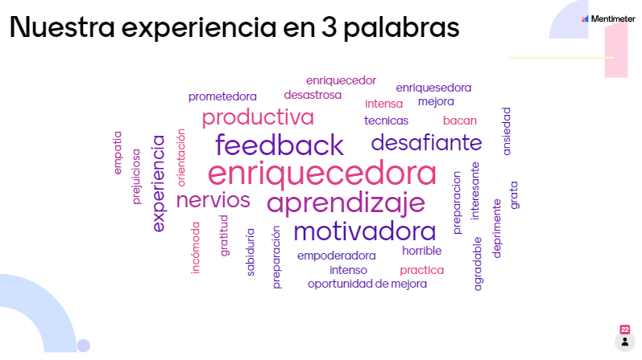

### Retrospectiva "tech mock interviews" (09-08-2022)

#### Nos dividimos en 2 salitas (45 minutos)

Dinámica de la instancia se desarrolló de la siguiente manera:
- Cada estudiante comparte su experiencia y principales aprendizajes en no más de 2 min.
- Una estudiante facilitadora modera el espacio y otra toma notas.

Sala 1 (Moderadora: Dani Aedo, Toma nota: Carolina Zapata) [Reflexiones](https://docs.google.com/spreadsheets/d/16kY4fsYnU1-1gMuDwFconXN7Mph9KA7Emmxg1azGkA8/edit#gid=1699660260)

Sala 2 (Moderadora: Sonia Reyes, Toma nota: Angélica Contreras) [Reflexiones](https://docs.google.com/spreadsheets/d/16kY4fsYnU1-1gMuDwFconXN7Mph9KA7Emmxg1azGkA8/edit#gid=2043433777)

### Compartimos nuestra experiencia den 3 palabras

### Retrospectiva en Figjam (30 minutos)

Reflexionamos en base a estas 3 preguntas:

- Que cosas hice bien?
- Que cosas no hice bien?
- Que accionables implementare para mejorar?

[Link a Figjam](https://www.figma.com/file/56ujwwQzwCY37EEMFGTB6K/Retrospectiva-de-entrevista-Tech-SCL020?node-id=1%3A177)